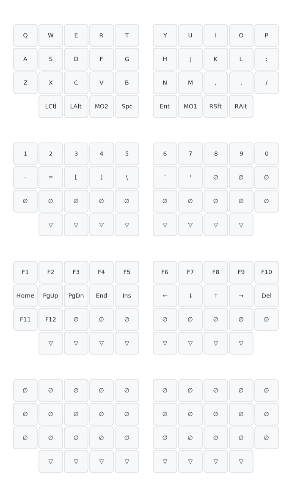

# kobitokey-o-oyayubi

自作分割キーボード「kobitokey」の親指キーを拡張したバージョンの KiCad プロジェクトとファームウェアです。

## 概要

左右分割型のキーボードで、メインユニットと親指ユニットで構成されています。Kailh Choc V2 ホットスワップソケットを使用し、PCB は JLCPCB で製造しています。親指ユニット上には Seeed XIAO nRF52840 BLE と PMW3610 光学トラックボールセンサーが搭載されており、左右それぞれ独立して BLE で通信します。

## 主要部品

- スイッチ: Kailh Choc V2 ホットスワップ（1.00u）
- ダイオード: SOD-123
- コネクタ: Hirose FH12-10S-0.5SH（FFC/FPC 10 ピン, 0.5mm ピッチ）
- MCU: Seeed XIAO nRF52840 BLE（左右親指ユニットに 1 個ずつ）
- トラックボール: PMW3610 光学センサー（左右親指ユニットに 1 個ずつ、3 線 SPI）

## ファームウェア

`firmware/` 以下が RMK ベースのファームウェアです。左右の XIAO nRF52840 BLE が `central`（右）と `peripheral`（左）として BLE で結合し、ホスト PC にも BLE 1 本でワイヤレス接続します。

### ビルド

devshell 内で:

```fish
cd firmware
cargo build --release --bin central
cargo build --release --bin peripheral
```

ELF → UF2 変換:

```fish
cargo objcopy --release --bin central     -- -O ihex central.hex
cargo objcopy --release --bin peripheral  -- -O ihex peripheral.hex
uf2conv central.hex    -f 0xADA52840 -co central.uf2
uf2conv peripheral.hex -f 0xADA52840 -co peripheral.uf2
```

### 書込

XIAO nRF52840 には Adafruit UF2 bootloader が書かれています。RST ボタンを素早く 2 回押すと `XIAO-BOOT` ドライブとしてマスストレージマウントされるので、対応する `.uf2` をドラッグ＆ドロップで書き込みます。

- 右ユニット → `central.uf2`
- 左ユニット → `peripheral.uf2`

### デバッグ

`probe-rs` + J-Link / DAPLink で SWD デバッグ・RTT ログ観察が可能です。

```fish
cargo run --release --bin central
```

`.cargo/config.toml` の `runner = "probe-rs run --chip nRF52840_xxAA"` が効きます。

### キーマップ



4 層構成（Layer0 / Layer1 / Layer2 / Layer3）。`firmware/keyboard.toml` の `[layout] keymap` を編集して再ビルドすると実機に反映されます。ドキュメント側の SVG を更新したい場合は、`firmware/keymap/kobitokey-o-oyayubi.yaml` を編集して devshell 内で以下を実行してください。

```fish
keymap draw firmware/keymap/kobitokey-o-oyayubi.yaml > firmware/keymap/kobitokey-o-oyayubi.svg
```

Vial による実機エディットに対応させる場合は `firmware/vial.json` を整備してください。
