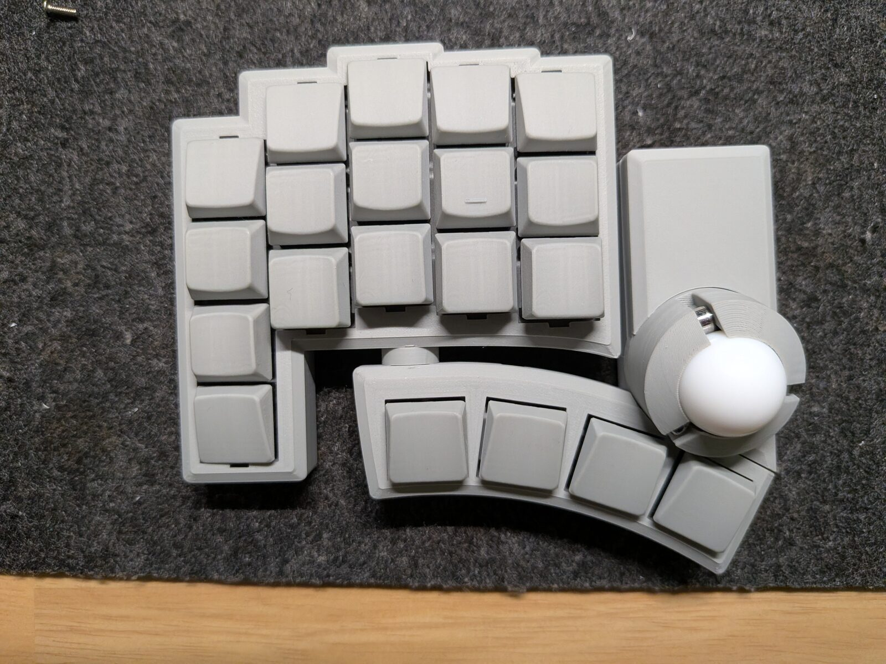

# kobu2 keymap editor

kobu2（v2）のキーマップとトラックボール設定を、ブラウザから直接編集する SPA です。
実機の見た目そのままの盤面を出し、**変えたいキーをクリックして選ぶ**だけで割り当てを
変更できます。

- 公開先: `https://kobu-editor.digletts.dev/v2/`（v1 と同じ Worker の `/v2` 配下）
- 対象: **kobu2 のみ**（USB PID `0x425A`）。初代 kobu はキー配列が違うので
  [`../../../v1/web/rmk-editor`](../../../v1/web/rmk-editor) を使ってください。
- 必要環境: WebHID が使えるデスクトップブラウザ（Chrome / Edge など Chromium 系）



## できること

| 機能 | 内容 |
|---|---|
| キーマップ編集 | 7 レイヤー × 40 キー。盤面のキーをクリック → 検索・カテゴリ・実キー入力から選択 |
| 動作の装飾 | 修飾つき (WM) / 長押しで修飾 (MT) / 長押しでレイヤー (LT) / レイヤー操作 (MO・TG・TO・OSL・DF) |
| チューニング | カーソル速度 (CPI 倍率)、スクロール間隔・反転、ステータス LED のしきい値。**その場で実機に反映** |
| バッテリー表示 | 左右それぞれの残量（30 秒ごとに自動更新） |
| デモ表示 | 実機が無くても盤面と操作感を確認できます |

キーマップの変更はいったん手元に溜まり、**「キーボードに書き込む」** で一括送信します
（Vial がロック解除を要求するので、そのとき左右いちばん外側の小指キーを押したままにしてください）。

## 開発

Node / pnpm はリポジトリルートの flake が固定しています。

```sh
cd v2/web/keymap-editor     # direnv が #web devshell を起動
pnpm install
pnpm dev                    # http://localhost:5173
pnpm test                   # vitest
pnpm lint                   # biome
pnpm typecheck
pnpm build                  # dist/
```

デプロイ用のビルドだけ `--base=/v2/` を付けます（`.github/workflows/web.yml` 参照）。
ローカルの `pnpm dev` / `pnpm build` は `/` のままです。

## 構成

| ディレクトリ | 中身 |
|---|---|
| `src/transport/` | WebHID による Vial パケット送受信。v1 エディタから流用（PID だけ kobu2 に限定） |
| `src/protocol/` | Via / Vial コマンド、ハンドシェイク、キーマップ、キーコード辞書、Custom Value。v1 から流用 |
| `src/board/` | **v2 固有**。実基板 CAD から起こしたジオメトリと、盤面 SVG |
| `src/state/` | zustand ストア（接続 / キーマップ / チューニング） |
| `src/components/` | UI |

### 盤面ジオメトリについて

`src/board/geometry.ts` の座標は実基板の KiCad から転記しています
（`v2/pcb/left-main`, `v2/pcb/thumb-left`）。v2 の基板はスイッチが **B.Cu 側**にあるため、
KiCad の標準表示は物理的な上面視と左右反転している点に注意してください（コード内に変換式を記載）。

メイン基板と親指基板は別プロジェクトで原点が無関係なので、その 2 つを繋ぐオフセットだけは
上の実機写真に合わせ込んでいます（誤差 2mm 程度）。右半分は左半分の鏡像として生成しています。

### チューニング値の永続性

チューニングの各項目は Via Custom Channel `0xC0` 経由でファームの atomic を直接書き換えます。
**ファームは保存しないため、電源を入れ直すと既定値に戻ります**
（`v2/firmware/rmk/src/config.rs` の "Persistence" を参照）。恒久的に変えたい場合は
`keyboard.toml` を編集して焼き直してください。

また 7 項目のうち「縦スクロール反転」と「LED 紫の保持時間」は、現在のファームに読み取り側が
無いため動作に影響しません。UI 上でも無効表示にしてあります。
